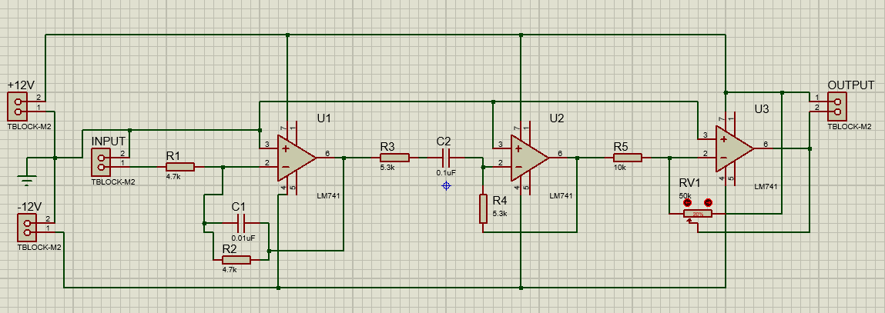
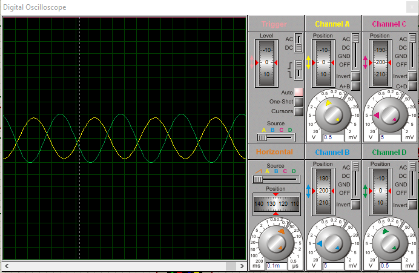
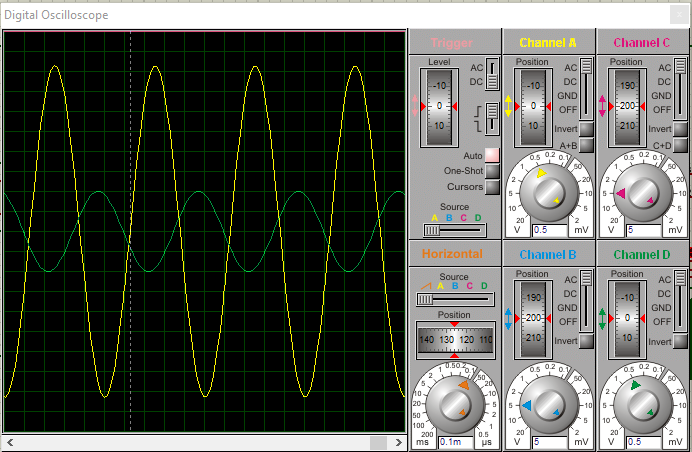
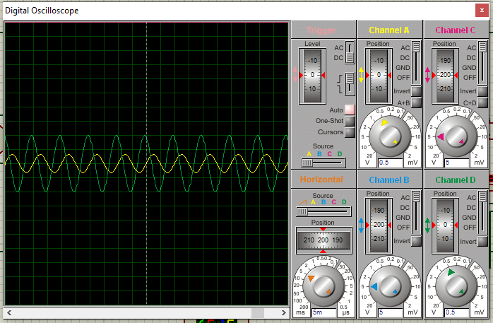
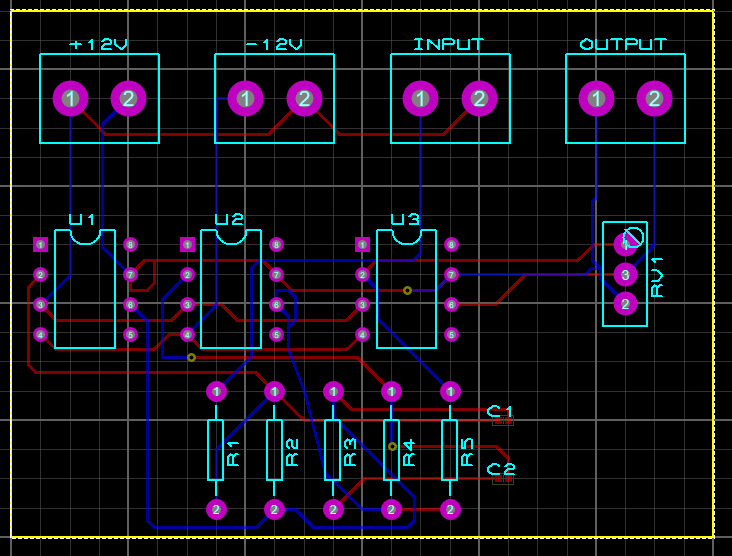
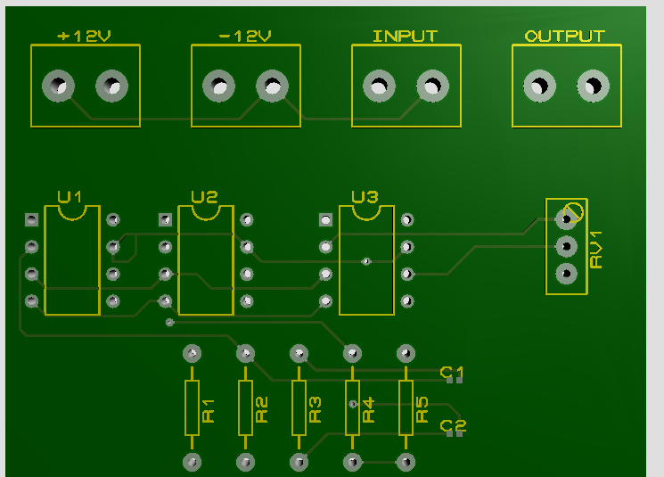

# 3-Stage Voice Active Band Filter with Output Gain Control
> **An analog signal processing project designed to isolate human voice frequencies (300 Hz – 3.4 kHz) using purely analog components.**
## 📌 Project Overview
**Circuit Analysis II Design Lab Report** **Author:** Sinan ONA  
**Institution:** Muğla Sıtkı Koçman University, Electrical & Electronics Engineering

This project involves the design, simulation, and hardware implementation of an **analog three-stage active band-pass filter** specifically tuned for the human voice frequency bandwidth (**300 Hz – 3.4 kHz**).

The system is designed entirely using fundamental analog components—operational amplifiers (Op-Amps), resistors, and capacitors—avoiding any microcontrollers or digital signal processing. It features a modular design with three distinct stages to filter noise and amplify the target signal.

---

## 🎯 Design Goals
The primary objective is to isolate and process voice signals while rejecting common noise sources.

* **Passband:** 300 Hz – 3.4 kHz (Human Voice Bandwidth).
* **Rejection:** Attenuates low-frequency hums (e.g., 50/60 Hz power line noise) and high-frequency artifacts.
* **Gain Control:** Includes a variable voltage gain stage for manual amplification adjustment.

---

## ⚙️ Technical Architecture
The circuit consists of three cascaded stages using **LM741 Operational Amplifiers**:

### 1. Active Low-Pass Filter (LPF)
* **Function:** Attenuates frequencies above **3.4 kHz**.
* **Purpose:** Eliminates high-frequency noise and interference.

### 2. Active High-Pass Filter (HPF)
* **Function:** Blocks frequencies below **300 Hz**.
* **Purpose:** Removes low-frequency rumble, environmental drift, and DC offsets.

### 3. Adjustable Gain Stage
* **Configuration:** Non-inverting op-amp gain stage.
* **Control:** A feedback potentiometer allows for user-defined gain adjustments to boost weak signals.

### Circuit Diagram

*Figure 1: Full Circuit Schematic showing the three cascaded Op-Amp stages.*

---

## 📊 Simulation & Results
The design was simulated and verified using **Proteus**.

* **Frequency Response:** Successfully passes signals within 300 Hz – 3.4 kHz with minimal attenuation.
* **Attenuation:** Frequencies outside the interval are lowered by **80% to 90%** relative to input voltages.

### Oscilloscope Analysis
| Input Range | Waveform Result |
| :--- | :--- |
| **In-Range (Standard)** |    *Figure 2: Input vs Output signals within the passband.* |
| **In-Range (Amplified)** |    *Figure 3: Output signal amplified via the gain stage.* |
| **Attenuation Test** |    *Figure 4: Signal attenuation outside the target frequency range.* |

---

## 🛠️ Hardware Implementation
The project includes a custom **PCB (Printed Circuit Board) layout** designed to minimize noise and organize components efficiently.

* **Power Supply:** Dual rail ±12V DC.
* **Components Used:**
    * 3x LM741 Op-Amps
    * Resistors (Values per schematic)
    * Capacitors (Values per schematic)
    * Potentiometer (RV1)
    * Terminal Blocks (Input, Output, Power)

### PCB Design
| 2D Layout | 3D Visualization |
| :---: | :---: |
|  |  |
| *Trace routing and component placement* | *3D rendering of the final board* |

---

## 🚀 Applications
This analog filter design is applicable in various industrial and consumer audio systems:
* **Voice Communication Systems:** Enhancing clarity in radio and telephony.
* **Audio Signal Conditioning:** Pre-processing for amplification.
* **Analog Synthesizers:** Voice signal isolation.
* **Telemetry & Analog Radio:** Signal tuning and noise reduction.

---

